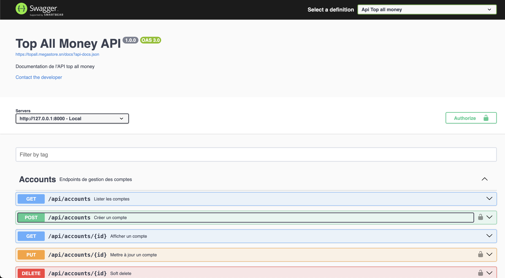

# Modular Financial Management Platform

A modern, modular financial management platform built with **Laravel 12**, designed for scalability, security, and extensibility.  
The system provides a secure REST API, a powerful back-office interface, and an architecture ready for mobile apps and SPAs.

---

## 🚀 Tech Stack

- **[Laravel 12](https://laravel.com/)** – PHP framework for rapid and elegant backend development
- **[Filament 4](https://filamentphp.com/)** – Admin panel & back-office UI
- **[L5-Swagger](https://github.com/DarkaOnLine/L5-Swagger)** – OpenAPI 3 documentation generator
- **[Sanctum](https://laravel.com/docs/12.x/sanctum)** – Lightweight API authentication (SPA & mobile friendly)
- **[spatie/laravel-permission](https://spatie.be/docs/laravel-permission/)** – Role and permission management
- **Micro-services oriented architecture** – Ready to scale into modular domains
- **GitHub Actions + Nginx VPS** – CI/CD pipeline and production deployment

---

## ✨ Features

- 🔐 **Secure REST API** with Sanctum authentication
- 📑 **OpenAPI documentation** generated automatically with L5-Swagger
- 🎛 **Back-office** powered by Filament 4 (dashboard, CRUDs, widgets, role-based access)
- 🛡 **Roles & Permissions** with fine-grained access control
- 📱 **Mobile & SPA-ready API design**
- ⚡ **Modular micro-services structure** for scalability and domain-driven design
- 🚢 **CI/CD pipeline** via GitHub Actions deploying directly to a VPS with Nginx

---
 
---

## 🔧 Installation

```bash
 
# Install dependencies
composer install
npm install && npm run build

# Copy environment variables
cp .env.example .env

# Generate app key
php artisan key:generate

# Run migrations
php artisan migrate --seed

# Serve the app
php artisan serve

php artisan l5-swagger:generate

# Run test

php artisan test

```

Deployed here:

Backoffice
[https://topall.megastore.sn/](https://topall.megastore.sn/)
Api docs :
[https://topall.megastore.sn/api/documentation](https://topall.megastore.sn/api/documentation)
 
